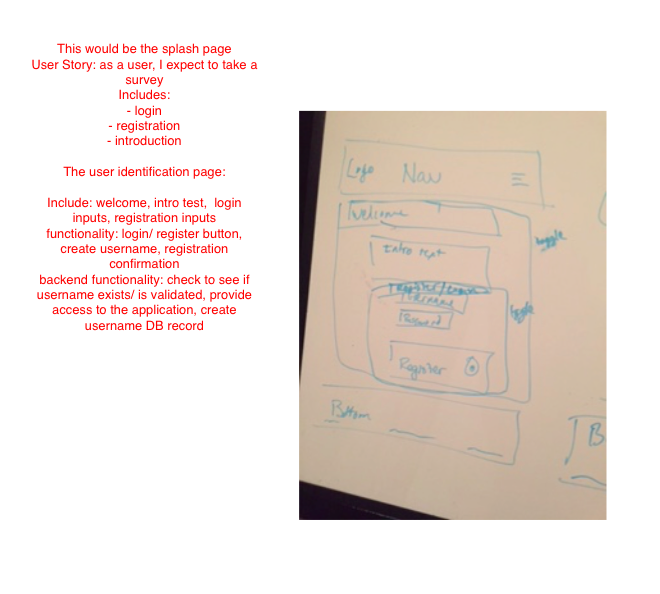
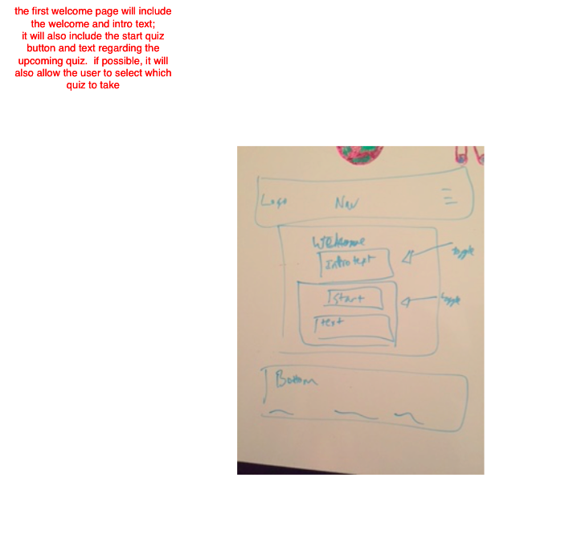
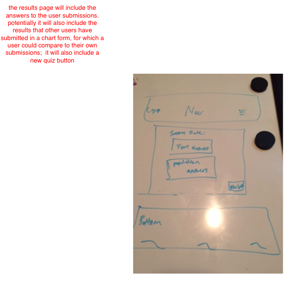
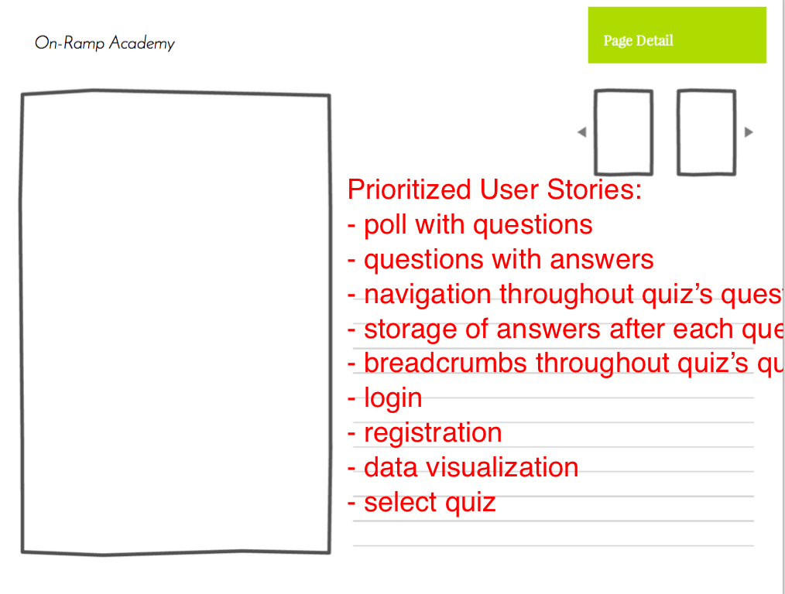
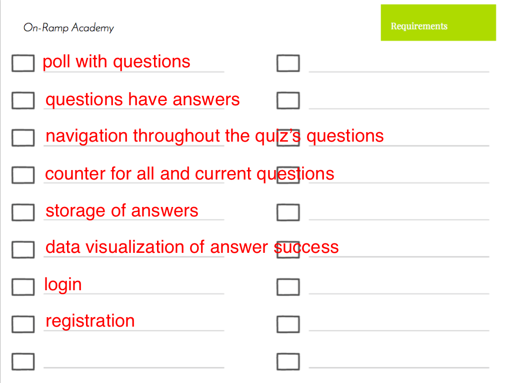
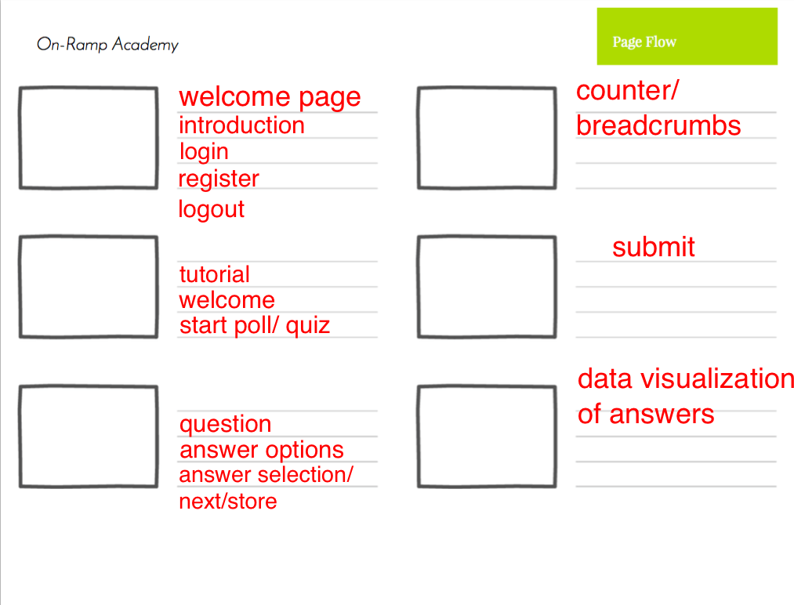
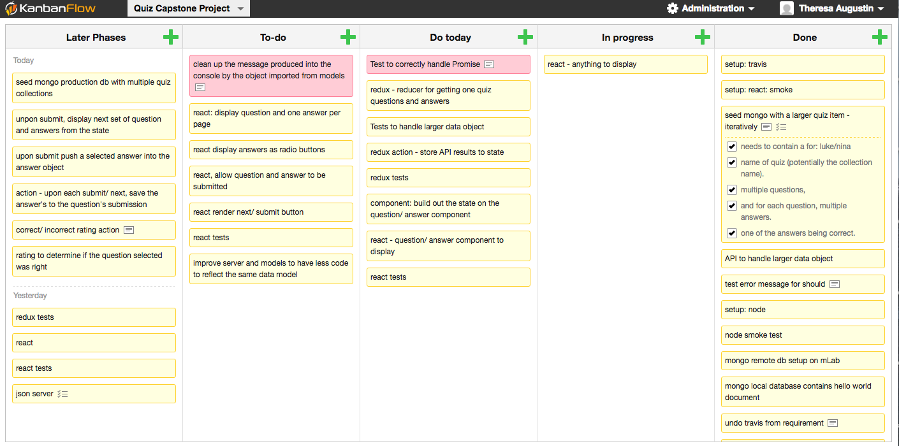
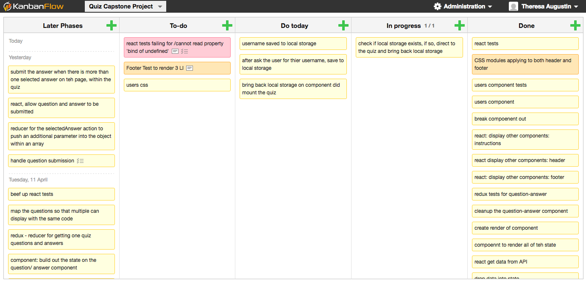

# Quiz Engine

## Overview:
* The quiz engine will inspire and allow students to learn and stay afresh with their studies over the summer months. A sense of accomplishment and desire to learn encouraged me to take and complete this course.  I would like to instill that same pursuit of knowledge into my younger relatives and see them grow to their potential.  

## Live Prototype:
* [Quiz Engine API](https://ancient-bayou-82562.herokuapp.com/quiz)
* [Quiz Engine Client with React](http://paratrooper-stuff-83443.netlify.com/)

## Use Case:

* the purpose of the quiz engine was two fold:
  * inspired by my younger cousins, I wanted to create an application to encourage them to learn
  * produce a showcase react application which can be utilized as a portfolio piece in order to solicit job offers from a dev team which works on a similar product

## Initial UX:

## Functionality:

## Development Story:
* Prioritized User Stories:
  * distribute quiz to users
  * select quiz
  * poll with questions
  * questions with answers
  * navigation throughout quiz’s questions
  * storage of answers after each question
  * breadcrumbs throughout quiz’s questions (counter)
  * login
  * registration
  * data visualization
  * retake quiz

## Technical:
* Web Technologies Utilized:
  * React
  * Redux
  * Node.js
  * Express
  * MongoDb, Mongoose, Robomongo
  * Yarn/ NPM
  * Enzyme, Chai, Mocha
  * Heroku, Netlify
  * Libraries: Lodash

## Lessons Learned:
* Deployment:
  * a full stack applicaiton requires the deployment of both a server to support the node.js/ server side development, as well as a server to host the client/ web view
  * While CreateReactApp's black box of scripts does not easily support the support of synchronous servers for full stack development, a couple of options were pursued.  
  * my options/ attempted options included a Thinkful approach to React Starter Apps, the concurrently plugin and a json server
  * The app utilizes two distinct projects, for the API and client.
  * The app utilizes deployment through Heroku and Netlify, for the respective projects. 

* Modern Frontend Framework:
  * Learning React and Redux was a challenge for me.  While I knew I would greatly enjoy server-side development before and during the program, the data flow and component lifestyle took a great amount of understanding.  While I resorted to many different documentation for learning, sticking to the FullStck React e-book gave me a respected and up-to-date perspective on React with ES6 and React Router 4.  
  * Redux with Async Actions can be difficult to learn.  While Dan Abramov's information on the web was very helpful, Thinkful mentor Q&A and Workshops were incredibly helpful as well.  The Thinkful community, including fellow students supported me in my learning.   I look forward to completing FullStack React's 30 days of React following Thinkful graduation. 

## Development Roadmap:
* utilizing a KanBan Board, the development was broken into phases
* working through the burn chart, I was able to break the project into bite size chunks
* working from the server side development through to the client-side, features were implemented based on priority

## Vision:
* The Quiz application still requires a significant amount of improvements in order to be more user friendly.  
  * If there is no user, present 'new user' in the header
  * Better tracking of selected and submitted questions in order for a more comprehensive results page
  * Account page to dispay results from all quizzes
  * Visual effects to keep the users engaged
* Provide more encouragement to learn and grow:
  * More quizzes to assist all cousins with subjects, advanced and younger.
  * Learn more button to be specific to the quiz, directing the user to another page to learn more about the subject
  * More links to learn more about coding, potentially instructing them to find the answers to the quizzes from the console
  * feedback after each question submission
* Testing:
  * I really enjoyed learning about the testing of the react and redux structure.  
  * I would like to improve the tests within my application and learn more about the structure and style of testing.  